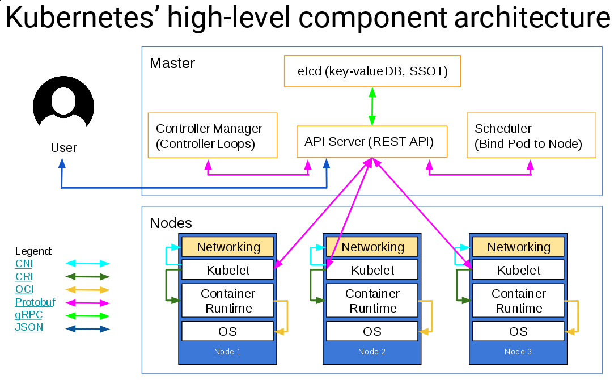

[](http://www.apache.org/licenses/LICENSE-2.0.html) [](https://travis-ci.org/simp/pupmod-simp-simp_kubernetes) [](https://gitlab.com/simp/pupmod-simp-simp_kubernetes/commits/master)


#### Table of Contents

1. [Description](#description)
2. [Setup - The basics of getting started with simp_kubernetes](#setup)
    * [What simp_kubernetes affects](#what-simp_kubernetes-affects)
    * [Setup requirements](#setup-requirements)
    * [Beginning with simp_kubernetes](#beginning-with-simp_kubernetes)
3. [Usage - Configuration options and additional functionality](#usage)
4. [Reference - An under-the-hood peek at what the module is doing and how](#reference)
5. [Limitations - OS compatibility, etc.](#limitations)
6. [Development - Guide for contributing to the module](#development)
    * [Acceptance Tests - Beaker env variables](#acceptance-tests)

## Description

Minimally manage a Kubernetes cluster! This module will configure the core
services required to get a basic Kubernetes cluster up and running, based on the
RedHat distribution available in the `extras` CentOS repo.

**This is currently Kubernetes 1.5**


(Source: https://speakerdeck.com/luxas/kubeadm-cluster-creation-internals-from-self-hosting-to-upgradability-and-ha)

This module can set up:
* Every host
  - `etcd` (only one peer has been tested)
  - `flanneld`
* Master hosts
  - `kube-apiserver`
  - `kube-controller-manager`
  - `kube-scheduler`
* Node hosts
  - `kubelet`
  - `kube-proxy`
* Kubeconfigs

Using the following packages from the CentOS Extras repo:
* kubernetes

This module will not interact with Kubernetes in any way, besides what can be
configured on a system level.

**NOTE:** This module only supports EL7.  **It does not support EL6.**

### This is a SIMP module

This module is a component of the [System Integrity Management
Platform](https://github.com/NationalSecurityAgency/SIMP), a
compliance-management framework built on Puppet.

If you find any issues, they may be submitted to our [bug
tracker](https://simp-project.atlassian.net/).

This module is optimally designed for use within a larger SIMP ecosystem, but
it can be used independently:

 * When included within the SIMP ecosystem, security compliance settings will
   be managed from the Puppet server, but only on the systems running kubernetes,
   not the content in kubernetes.
 * If used independently, all SIMP-managed security subsystems are disabled by
   default and must be explicitly opted into by administrators.  Please review
   the parameters in
   [`simp/simp_options`](https://github.com/simp/pupmod-simp-simp_options) for
   details.

## Setup

### What simp_kubernetes affects


simp_kubernetes only sets up the services listed above, with a few catches:

* The integration with SIMP's PKI may give you trouble, because kubernetes
  expects certificates with IP subjectAltNames
* This module does not deploy any services on kubernetes, even if they are
  required for a complete set up
* There are no Load Balancers available in the CentOS repos, so there is not one
  available out of the box using this module

 **NOTE:** This module only supports EL7.  **It does not support EL6.**

### Usage

The minimal set up would look as follows:

##### On all nodes:
```puppet
class { 'simp_kubernetes':
  etcd_peers   => ['kube-master01.domain.net'],
  kube_masters => ['kube-master01.domain.net','kube-master02.domain.net','kube-master03.domain.net']
}
```
or in hiera:
```yaml
---
simp_kubernetes::is_master: true
simp_kubernetes::etcd_peers:
- kube-master01.domain.net
simp_kubernetes::kube_masters:
- kube-master01.domain.net
- kube-master02.domain.net
- kube-master03.domain.net
```


##### On the master node (only one is supported at this time):
```puppet
class { 'simp_kubernetes':
  etcd_peers   => ['kube-master01.domain.net'],
  kube_masters => ['kube-master01.domain.net','kube-master02.domain.net','kube-master03.domain.net'],
  is_master    => true
}
```
or in hiera:
```yaml
---
simp_kubernetes::is_master: true
```

Where `etcd_peers` is a list of hostnames that will be etcd servers, and
`kube_masters` is the list of servers where the kubernetes API will be available.
These parameters will result in a kubernetes cluster using flannel as a network
backend with all communication over http.

If you need a HA etcd, you will probably be better off setting that up elsewhere
for now, and setting `manage_etcd` to `false`.


To enable TLS, call your class like this:

```puppet
class { 'simp_kubernetes':
  etcd_peers           => ['kube-master01.domain.net'],
  etcd_peer_protocol   => 'https',
  etcd_client_protocol => 'https',
  etcd_app_pki_key     => '/path/to/cert',
  etcd_app_pki_cert    => '/path/to/cert',
  etcd_app_pki_ca      => '/path/to/cert',
  kube_masters         => ['kube-master01.domain.net','kube-master02.domain.net','kube-master03.domain.net'],
  kube_api_protocol    => 'https',
  kubelet_protocol     => 'https',
  kube_api_port        => 6443,
  app_pki_key          => '/path/to/cert',
  app_pki_cert         => '/path/to/cert',
  app_pki_ca           => '/path/to/cert',
}
```

There are many parameters in this module that are useful for tweaking every
service in this module:
* `flannel_network_config`
* `flannel_args`
* `etcd_options`
* `api_args`
* `master_api_args`
* `scheduler_args`
* `controller_args`
* `proxy_args`
* `kubelet_args`

## Reference

Please refer to the inline documentation within each source file, or to the
module's generated YARD documentation for reference material.

## Limitations

This module is only intended to work with RedHat's distribution of kubernetes.
If a newer version is required or a version from a different source, this module
may not work as intended.

SIMP Puppet modules are generally intended for use on Red Hat Enterprise Linux
and compatible distributions, such as CentOS. Please see the
[`metadata.json` file](./metadata.json) for the most up-to-date list of
supported operating systems, Puppet versions, and module dependencies.

## Development

Please read our [Contribution Guide](http://simp-doc.readthedocs.io/en/stable/contributors_guide/index.html).

### Acceptance tests

This module includes [Beaker](https://github.com/puppetlabs/beaker) acceptance
tests using the SIMP [Beaker Helpers](https://github.com/simp/rubygem-simp-beaker-helpers).
By default the tests use [Vagrant](https://www.vagrantup.com/) with
[VirtualBox](https://www.virtualbox.org) as a back-end; Vagrant and VirtualBox
must both be installed to run these tests without modification. To execute the
tests run the following:

```shell
bundle install
bundle exec rake beaker:suites
```

There is also a suite in simp-core (kubernetes) that tests this component in the
context of a SIMP system.

Please refer to the [SIMP Beaker Helpers documentation](https://github.com/simp/rubygem-simp-beaker-helpers/blob/master/README.md)
for more information.
